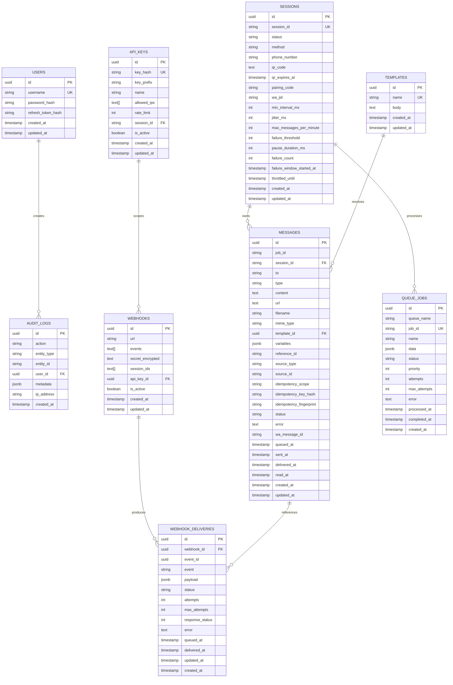

# Entity Relationship Diagram — WA Gateway Go

ERD ini mempertahankan schema final project Node.js, termasuk migration untuk
hash API key, idempotency, webhook delivery, scope, encrypted secret,
throttling, dan preservasi history session.

## Integrity rules

1. `messages.session_id` references `sessions.session_id` with `ON DELETE
   RESTRICT`; message history tidak boleh hilang karena delete session.
2. `messages(idempotency_scope, idempotency_key_hash)` unique hanya jika kedua
   kolom tidak null.
3. `api_keys.key_hash` unique; kolom plaintext key tidak boleh ada.
4. Secret webhook disimpan encrypted; response API tidak mengembalikan secret.
5. `messages.status` hanya boleh bergerak maju secara monotonic, kecuali
   resend membuat job baru atau mengembalikan message yang gagal ke queued.
6. `webhook_deliveries` immutable pada payload/event; retry hanya mengubah status,
   attempts, response, dan error.
7. `queue_jobs.data` menyimpan snapshot job untuk audit, sementara Redis/asynq
   menjadi executor.

## WhatsApp auth store

`whatsmeow` memiliki device/auth store sendiri. Store ini adalah bagian dari
credential session dan tidak boleh dicampur dengan tabel `messages`. Untuk MVP,
gunakan PostgreSQL store yang dikelola `whatsmeow`; jika versi library yang
dipilih membutuhkan schema khusus, letakkan tabelnya dalam schema/database
terpisah dan jangan melakukan migration manual terhadap tabel internalnya.
